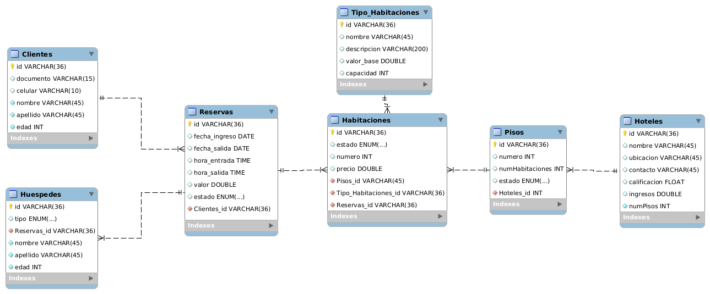

<p align="center">
  <a href="http://nestjs.com/" target="blank"></a>
</p>


## Description

[Nest](https://github.com/nestjs/nest) framework TypeScript starter repository.


# Hotel Chain Management with NestJS

This project implements a hotel chain management application using NestJS. The application meets the main requirements for hotel management, including creating, searching, updating, and deleting hotels. Additionally, it includes user registration modules, authentication with guards to protect certain parts of the controllers, and user roles such as employees, users, administrators, and developers.

### Project Structure

The project is structured as follows:

```markdown
project/
├── nestjs_project/ 
│   |      
│   ├── src/
│   │   ├── develop/
│   │   │   ├── authenticate/
│   │   │   │   ├── controller/
│   │   │   │   ├── dtos/
│   │   │   │   ├── guard/
│   │   │   │   ├── jwt/
│   │   │   │   ├── service/
│   │   │   │   ├── types/
│   │   │   │   └── auth.module.ts
│   │   │   ├── decorators/
│   │   │   ├── persistence/
│   │   │   │   └── database.connection.ts
│   │   │   └── shared-modules/
│   │   ├── hotels-modules/
│   │   │   ├── user/
│   │   │   │   ├── controller/
│   │   │   │   ├── dtos/
│   │   │   │   ├── service/
│   │   │   │   └── entities/
│   │   │   └── admin/
│   │   │       ├── controller/
│   │   │       ├── dtos/
│   │   │       ├── service/
│   │   |       └── entities/
|   |   └───  hotel.module.ts
│   ├────── main.ts
│   └──────── app.module.ts
|
├── package.json
├── tsconfig.json
└── README.md

```


## Installation

```bash
$ git clone https://github.com/cristianManco/continental_hotels.git
$ cd continental_hotels
$ yarn install
```

## Running the app

```bash
# development
$ yarn run start

# watch mode
$ yarn run start:dev

# production mode
$ yarn run start:prod
```

## Test

```bash
# unit tests
$ yarn run test

# e2e tests
$ yarn run test:e2e

# test coverage
$ yarn run test:cov
```

### Database Diagrams

#### Hotel

```markdown

+----------------------+       +----------------------+       +----------------------+
|  Hotel               |       | CreateHotelDto       |       | UpdateHotelDto        |
|----------------------|       |----------------------|       |-----------------------|
| - id: string         |       | - name: string       |       | - name?: string       |
| - name: string       |       | - address: string    |       | - address?: string    |
| - address: string    |       | - rating: number     |       | - rating?: number     |
| - rating: number     |       | - rooms: number      |       | - rooms?: number      |
| - rooms: number      |       | - amenities: string[]|       | - amenities?: string[]|
| - amenities: string[]|       |                      |       |                       |
+----------------------+       +----------------------+       +-----------------------+
```

#### HotelService

```
+-------------------------------------------------------+
|  HotelService                                         |
|-------------------------------------------------------|
| - model: Model<Hotel>                                 |
|-------------------------------------------------------|
| + create(CreateHotelDto): Promise<Hotel>              |
| + findAll(): Promise<Hotel[]>                         |
| + findOne(id: string): Promise<Hotel>                 |
| + update(id: string, UpdateHotelDto): Promise<Hotel>  |
| + remove(id: string): Promise<void>                   |
+-------------------------------------------------------+
```

#### HotelController

```
+-----------------------------------------------------+
| HotelController                                     |
|-----------------------------|                       |
| - hotelService: HotelService                        |
|-----------------------------------------------------|
| + create(CreateHotelDto): Promise<Hotel>            |
| + findAll(): Promise<Hotel[]>                       |
| + findOne(id: string): Promise<Hotel>               |
| + update(id: string, UpdateHotelDto): Promise<Hotel>|
| + remove(id: string): Promise<void>                 |
+-----------------------------------------------------+
```

#### Admin

```
+-------------------+       +-------------------+       +--------------------+
|  Admin            |       | CreateAdminDto    |       | UpdateAdminDto     |
|-------------------|       |-------------------|       |--------------------|
| - name: string    |       | - name: string    |       | - name?: string    |
| - phone: string   |       | - phone: string   |       | - phone?: string   |
| - email: string   |       | - email: string   |       | - email?: string   |
| - password: string|       | - password: string|       | - password?: string|
| - role: UserType  |       | - role?: string   |       | - role?: string    |
| - createdAt?: Date|       |                   |       |                    |
+-------------------+       +-------------------+       +--------------------+
```

#### AdminService

```
+-----------------------------------------------------+
|  AdminService                                       |
|-----------------------------------------------------|
| + create(CreateAdminDto): Promise<Admin>            |
| + findAll(): Promise<Admin[]>                       |
| + findOne(id: string): Promise<Admin>               |
| + update(id: string, UpdateAdminDto): Promise<Admin>|
| + remove(id: string): Promise<void>                 |
+-----------------------------------------------------+
```

#### AdminController

```
+-------------------------+
| AdminController         |
|-------------------------|
| - service: AdminService |
+-------------------------+
```


#### Folder and File Description

- **src/**: Contains the main logic of the application.
  - **develop/**: Development module including authentication.
    - **authenticate/**: Functionalities related to authentication.
      - **controller/**: Controllers to handle authentication-related requests.
      - **dtos/**: DTOs (Data Transfer Objects) to define the structure of transferred data.
      - **guard/**: Guards to protect routes and controllers.
      - **jwt/**: Functionalities related to JWT token generation and validation.
      - **service/**: Services to handle authentication logic.
      - **types/**: Custom data types.
      - **auth.module.ts**: NestJS authentication module.

  - **hotels-modules/**: Hotel management module.
    - **user/**: Functionalities related to users.
      - **controller/**: Controllers to handle user-related requests.
      - **dtos/**: DTOs to define the structure of user-related data.
      - **service/**: Services to handle business logic related to users.
      - **entities/**: Entity definitions for user-related database tables.

    - **admin/**: Functionalities related to administrators.
      - **controller/**: Controllers to handle administrator-related requests.
      - **dtos/**: DTOs to define the structure of administrator-related data.
      - **service/**: Services to handle business logic related to administrators.
      - **entities/**: Entity definitions for administrator-related database tables.

  - **main.ts**: Main entry point of the application.
  - **app.module.ts**: Main module of the application where main modules, controllers, and services are defined.

### Main Features

The application meets the following requirements:

- Creating, searching, updating, and deleting hotels.
- User registration with different roles: employees, users, administrators, and developers.
- User authentication with guards to protect certain parts of the controllers.
- Role-based authorization functionalities to allow or deny access to certain

 parts of the application based on the user's role.

### Installation and Execution

To install and run the application, follow these steps:

1. Clone the repository from GitHub.
2. Navigate to the project folder.
3. Install dependencies with `npm install`.
4. Run the application with `npm start`.

Make sure you have Node.js and npm installed on your system before running the application.

### Contributions

Contributions are welcome. If you'd like to contribute to the project, follow these steps:

1. Fork the repository.
2. Create a new branch for your feature (`git checkout -b feature/new-feature`).
3. Make your changes and commit them (`git commit -am 'Add a new feature'`).
4. Push to the branch (`git push origin feature/new-feature`).
5. Create a new Pull Request.


## Stay in touch

- Author - [Cristian manco](https://github.com/cristianManco)

### License

Nest is [MIT licensed](LICENSE).


### diagrams DB



```markdown

+----------------------+       +----------------------+       +----------------------+
|  Hotel               |       | CreateHotelDto       |       | UpdateHotelDto        |
|----------------------|       |----------------------|       |-----------------------|
| - id: string         |       | - name: string       |       | - name?: string       |
| - name: string       |       | - address: string    |       | - address?: string    |
| - address: string    |       | - rating: number     |       | - rating?: number     |
| - rating: number     |       | - rooms: number      |       | - rooms?: number      |
| - rooms: number      |       | - amenities: string[]|       | - amenities?: string[]|
| - amenities: string[]|       |                      |       |                       |
+----------------------+       +----------------------+       +-----------------------+
```
#### Service

```
+-------------------------------------------------------+
|  HotelService                                         |
|-------------------------------------------------------|
| - model: Model<Hotel>                                 |
|-------------------------------------------------------|
| + create(CreateHotelDto): Promise<Hotel>              |
| + findAll(): Promise<Hotel[]>                         |
| + findOne(id: string): Promise<Hotel>                 |
| + update(id: string, UpdateHotelDto): Promise<Hotel>  |
| + remove(id: string): Promise<void>                   |
+-------------------------------------------------------+

+-----------------------------------------------------+
| HotelController                                     |
|-----------------------------|                       |
| - hotelService: HotelService                        |
|-----------------------------------------------------|
| + create(CreateHotelDto): Promise<Hotel>            |
| + findAll(): Promise<Hotel[]>                       |
| + findOne(id: string): Promise<Hotel>               |
| + update(id: string, UpdateHotelDto): Promise<Hotel>|
| + remove(id: string): Promise<void>                 |
+-----------------------------------------------------+
```

#### Admin

```
+-------------------+       +-------------------+       +--------------------+
|  Admin            |       | CreateAdminDto    |       | UpdateAdminDto     |
|-------------------|       |-------------------|       |--------------------|
| - name: string    |       | - name: string    |       | - name?: string    |
| - phone: string   |       | - phone: string   |       | - phone?: string   |
| - email: string   |       | - email: string   |       | - email?: string   |
| - password: string|       | - password: string|       | - password?: string|
| - role: UserType  |       | - role?: string   |       | - role?: string    |
| - createdAt?: Date|       |                   |       |                    |
+-------------------+       +-------------------+       +--------------------+
```

#### AdminService

```
+-----------------------------------------------------+
|  AdminService                                       |
|-----------------------------------------------------|
| + create(CreateAdminDto): Promise<Admin>            |
| + findAll(): Promise<Admin[]>                       |
| + findOne(id: string): Promise<Admin>               |
| + update(id: string, UpdateAdminDto): Promise<Admin>|
| + remove(id: string): Promise<void>                 |
+-----------------------------------------------------+
```


Component architecture model: This model allows you to decompose your system into individual logical or functional components. For example, get components such as Web Server, Database, User Interface
Web Server Component:
- Manage HTTP requests and responses.

Database Component:
- Stores and manages system data.

User Interface Component:
- Provides a graphical interface to interact with the system.